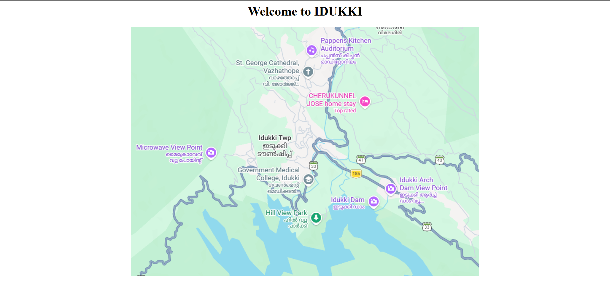
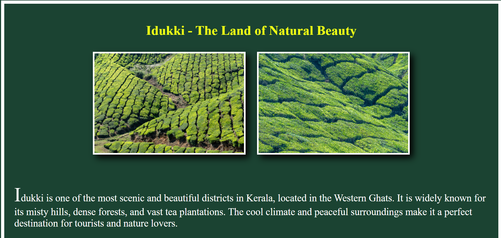
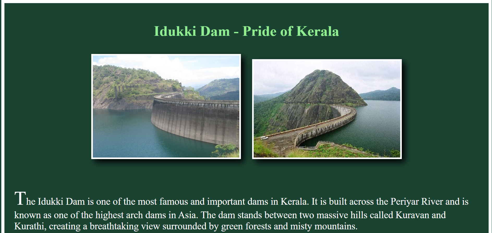
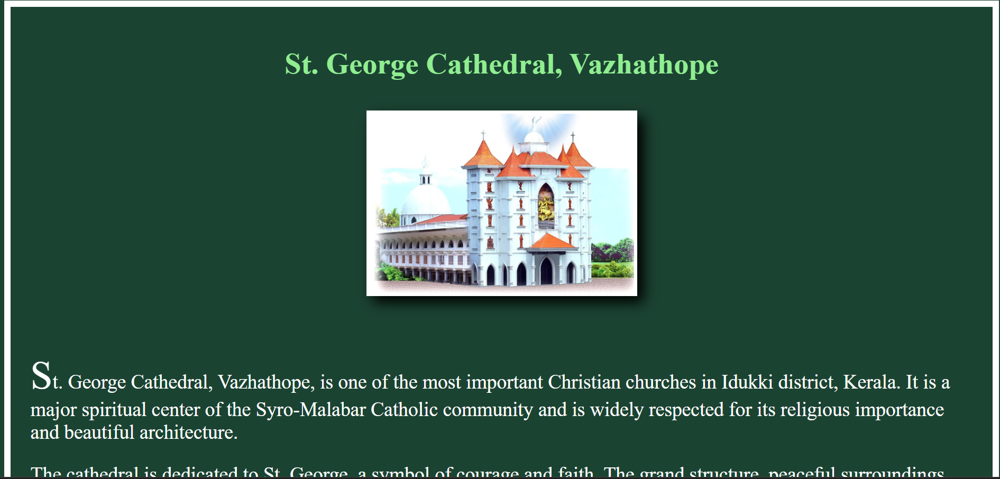
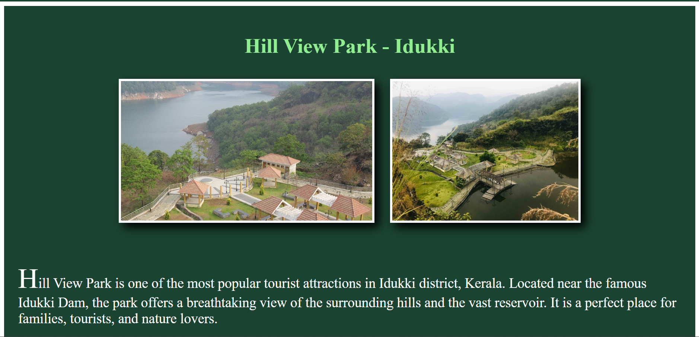

# Ex03 Places Around Me
## Date: 12-02-2026

## AIM
To develop a website to display details about the places around my house.

## DESIGN STEPS

### STEP 1
Create a Django admin interface.

### STEP 2
Download your city map from Google.

### STEP 3
Using ```<map>``` tag name the map.

### STEP 4
Create clickable regions in the image using ```<area>``` tag.

### STEP 5
Write HTML programs for all the regions identified.

### STEP 6
Execute the programs and publish them.

## CODE

map.html:
```
<html>
    <head>
        <h1 align="center"> Welcome to IDUKKI </h1>
    </head>
    <center>
            
    </center>
    <map name="newmap">
        <area target="" alt="IDUKKI" title="IDUKKI" href="idukki.html" coords="362,295,36" shape="circle">
        <area target="" alt="IDUKKIDAM" title="IDUKKIDAM" href="dam.html" coords="611,440,19" shape="circle">
        <area target="" alt="CATHEDERAL" title="CATHEDERAL" href="cathedral.html" coords="446,113,13" shape="circle">
        <area target="" alt="PARK" title="PARK" href="park.html" coords="466,480,16" shape="circle">
    </map>

</html>
```
idukki.html:
```
<!DOCTYPE html>
<html>
<head>
    <title>Idukki</title>
</head>

<body bgcolor="#1b4332" 
      style="border:10px solid white; padding:30px;">

    <h1 style="text-align:center; color:rgb(239, 255, 21); font-size:40px;">
        Idukki - The Land of Natural Beauty
    </h1>

    <div>

        <center>
            

            
        </center>

        <br><br>

        <p style="font-size:30px; color:white;">
            <span style="font-size:200%;">I</span>dukki is one of the most scenic and beautiful districts in Kerala, located in the 
            Western Ghats. It is widely known for its misty hills, dense forests, and vast tea plantations. 
            The cool climate and peaceful surroundings make it a perfect destination for tourists and nature lovers.
        </p>

        <p style="font-size:30px; color:white;">
            The district is home to the famous Idukki Arch Dam, one of the highest arch dams in Asia. 
            Popular tourist places like Munnar, Thekkady, and Periyar Wildlife Sanctuary attract 
            thousands of visitors every year.
        </p>

        <p style="font-size:30px; color:white;">
            Idukki offers a refreshing escape from busy city life. The natural beauty and calm environment 
            create a memorable experience for everyone who visits.
        </p>

    </div>

</body>
</html>

```
dam.html:
```
<!DOCTYPE html>
<html>
<head>
    <title>Idukki Dam</title>
</head>

<body bgcolor="#1b4332" 
      style="border:10px solid white; padding:30px;">

    <h1 style="text-align:center; color:lightgreen; font-size:45px;">
        Idukki Dam - Pride of Kerala
    </h1>

    <center>
        

        
    </center>

    <br><br>

    <p style="font-size:30px; color:white;">
        <span style="font-size:200%;">T</span>he Idukki Dam is one of the most famous and important dams in Kerala. 
        It is built across the Periyar River and is known as one of the highest arch dams in Asia. 
        The dam stands between two massive hills called Kuravan and Kurathi, creating a breathtaking view 
        surrounded by green forests and misty mountains.
    </p>

    <p style="font-size:30px; color:white;">
        Constructed in 1975, the dam plays a major role in generating hydroelectric power for the state. 
        It is part of the Idukki Hydroelectric Project and supplies electricity to a large portion of Kerala. 
        The structure itself is an engineering marvel and attracts thousands of tourists every year.
    </p>

    <p style="font-size:30px; color:white;">
        During the monsoon season, when the shutters are opened, it becomes a spectacular sight to watch. 
        The calm reservoir, scenic surroundings, and cool climate make Idukki Dam not only a power source 
        but also a symbol of Kerala’s natural beauty and technological achievement.
    </p>

</body>
</html>

```
cathedral.html:
```
<!DOCTYPE html>
<html>
<head>
    <title>St. George Cathedral Vazhathope</title>
</head>

<body bgcolor="#1b4332" 
      style="border:10px solid white; padding:30px;">

    <h1 style="text-align:center; color:lightgreen; font-size:45px;">
        St. George Cathedral, Vazhathope
    </h1>

    <center>

        

        

    </center>

    <br><br>

    <p style="font-size:30px; color:white;">
        <span style="font-size:200%;">S</span>t. George Cathedral, Vazhathope, is one of the most important 
        Christian churches in Idukki district, Kerala. It is a major spiritual center of the 
        Syro-Malabar Catholic community and is widely respected for its religious importance 
        and beautiful architecture.
    </p>

    <p style="font-size:30px; color:white;">
        The cathedral is dedicated to St. George, a symbol of courage and faith. The grand 
        structure, peaceful surroundings, and elegant interior design attract thousands of 
        devotees and visitors every year. The church stands as a landmark of devotion 
        and unity in the region.
    </p>

    <p style="font-size:30px; color:white;">
        The annual feast of St. George is celebrated with great devotion and joy. 
        Special prayers, colorful processions, and community gatherings make the 
        celebration memorable. The cathedral also plays an important role in 
        social and charitable activities in the area.
    </p>

</body>
</html>

```
park.html:
```
<!DOCTYPE html>
<html>
<head>
    <title>Hill View Park Idukki</title>
</head>

<body bgcolor="#1b4332" 
      style="border:10px solid white; padding:30px;">

    <h1 style="text-align:center; color:lightgreen; font-size:45px;">
        Hill View Park - Idukki
    </h1>

    <center>

        

        

    

    </center>

    <br><br>

    <p style="font-size:30px; color:white;">
        <span style="font-size:200%;">H</span>ill View Park is one of the most popular tourist attractions 
        in Idukki district, Kerala. Located near the famous Idukki Dam, the park offers 
        a breathtaking view of the surrounding hills and the vast reservoir. It is a perfect 
        place for families, tourists, and nature lovers.
    </p>

    <p style="font-size:30px; color:white;">
        The park is beautifully maintained with gardens, walking paths, and scenic viewpoints. 
        Visitors can enjoy the cool breeze, peaceful environment, and stunning landscapes. 
        There are also small play areas for children and boating facilities nearby.
    </p>

    <p style="font-size:30px; color:white;">
        Hill View Park is especially attractive during the evening when the sunset creates 
        a magical view over the hills and water. It is a must-visit destination for anyone 
        traveling to Idukki, offering both relaxation and natural beauty.
    </p>

</body>
</html>

```
## OUTPUT

map:


idukki:


dam:


cathedral:


park:



## RESULT
The program for implementing image maps using HTML is executed successfully.
